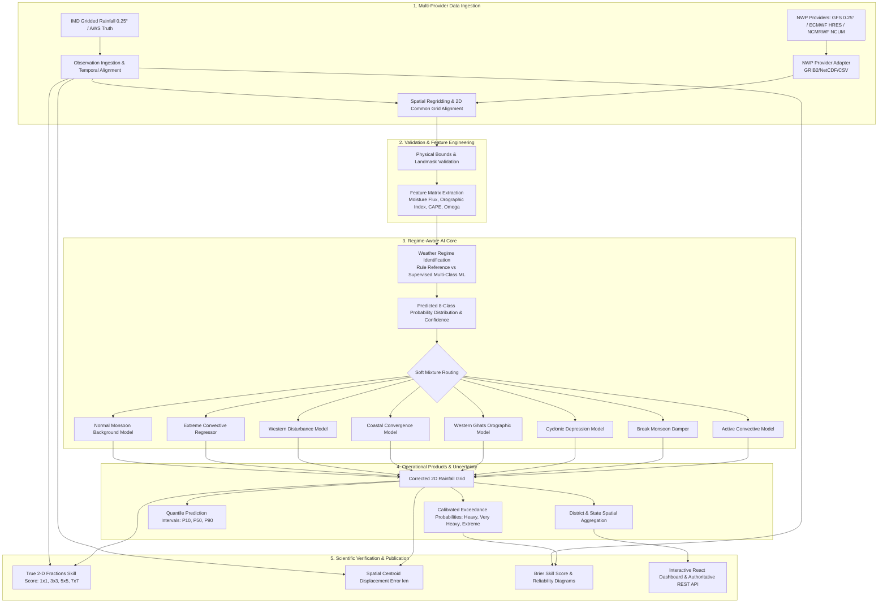

# Regime-Aware AI Post-Processing of Monsoon Rainfall Forecasts

**Problem Statement ID:** 26080  
**Title:** Regime-Aware AI Post-Processing of Monsoon Rainfall Forecasts  
**Domain:** Artificial Intelligence / Machine Learning, Synoptic & Mesoscale Meteorology, Numerical Weather Prediction (NWP), Geospatial Modeling

---

## 1. Problem Statement & Motivation

During the Indian Summer Monsoon (June–September / JJAS), raw Numerical Weather Prediction (NWP) models (such as GFS, NCMRWF Unified Model / NCUM, ECMWF IFS) exhibit significant, regime-dependent precipitation forecast biases:

- **Active Monsoon Spells:** Severe dry bias where models fail to resolve the full intensity of convective precipitation cores along the monsoon trough.
- **Break Monsoon Spells:** Continental wet bias and false-alarm convective bursts across central India while actual rain shifts north to the Himalayan foothills.
- **Western Ghats & Northeast Hills:** Systematic underestimation of localized orographic enhancement due to coarse grid smoothing of mountain barriers.
- **Monsoon Lows & Depressions:** Spatial track displacement and peak rainfall intensity attenuation.

Standard global bias-correction methods (e.g., uniform linear scaling or monolithic ML post-processors) treat all forecast errors uniformly, leading to overcorrection in dry spells and undercorrection in extreme rain events. 

This project implements an end-to-end, scientifically credible **Regime-Aware AI Post-Processing Architecture** that:
1. Classifies the prevailing synoptic/mesoscale weather regime using both rule-based physical reference baselines and supervised machine learning classifiers.
2. Performs soft continuous mixture-of-experts routing using predicted class probability distributions across regimes.
3. Produces calibrated exceedance probabilities for IMD operational thresholds (Heavy $\ge 64.5$ mm, Very Heavy $\ge 115.6$ mm, Extreme $\ge 204.5$ mm).
4. Estimates forecast uncertainty intervals ($P_{10}, P_{50}, P_{90}$).
5. Evaluates spatial accuracy using genuine 2-D Fractions Skill Score (FSS) across multi-scale neighborhood windows ($1\times1, 3\times3, 5\times5, 7\times7$).

---

## 2. System Architecture



---

## 3. Directory Structure

```text
rainfall-ai/
│
├── configs/
│   └── config.yaml               # Central configuration (thresholds, regimes, models)
├── data/
│   ├── raw/
│   │   ├── nwp/                  # Raw NWP files (GFS, ECMWF, NCMRWF in NetCDF/GRIB2)
│   │   └── observations/         # Raw IMD gridded rainfall files
│   ├── processed/                # Validated, cleaned, and normalized data
│   └── synthetic/                # Benchmark multi-year Indian monsoon dataset (2018-2024)
│
├── src/
│   ├── data/
│   │   ├── nwp/                  # Multi-provider NWP adapter architecture
│   │   │   ├── base.py           # Canonical variables & unit conversions (K->C, Pa->hPa)
│   │   │   ├── gfs_adapter.py    # NOAA GFS 0.25° adapter
│   │   │   ├── ecmwf_adapter.py  # ECMWF IFS/HRES adapter
│   │   │   ├── ncmrwf_adapter.py # MoES NCMRWF NCUM/NEPS adapter
│   │   │   └── factory.py        # Adapter factory
│   │   ├── observations/         # Independent observation ingestion
│   │   │   ├── base.py           # Observation provider base class
│   │   │   ├── imd_gridded.py    # IMD 0.25° daily gridded rainfall (Pai et al.)
│   │   │   └── regridding.py     # Bilinear regridding & temporal alignment
│   │   ├── validation.py         # Physical bounds & coordinate checks
│   │   └── feature_engineering.py# Orographic index, moisture flux, CAPE
│   │
│   ├── regimes/
│   │   ├── rules.py              # Rule-based meteorological reference classifier
│   │   ├── classifier.py         # Supervised ML Regime Classifier with probabilities
│   │   └── regime_features.py    # Regime embeddings
│   │
│   ├── models/
│   │   ├── baseline.py           # Raw NWP & Global Bias Correction
│   │   ├── regime_model.py       # Regime-Specific ML with soft mixture routing
│   │   ├── correction.py         # Non-negative constraints & log1p inversion
│   │   ├── probabilistic.py      # Calibrated probabilities & P10/P50/P90 quantiles
│   │   ├── ensemble.py           # Hybrid regime-aware ensemble model
│   │   ├── registry.py           # Model manifest & training provenance
│   │   └── explainability.py     # Local feature attributions & XAI
│   │
│   ├── verification/
│   │   ├── deterministic.py      # RMSE, MAE, Bias, Pearson Correlation
│   │   ├── categorical.py        # Contingency table, CSI, ETS, POD, FAR
│   │   ├── spatial.py            # Genuine 2-D Fractions Skill Score (FSS) & Displacement
│   │   └── reports.py            # Comparative & regime-wise verification reports
│   │
│   ├── geo/
│   │   ├── grid.py               # 2-D regular India grid, land-sea mask, GeoJSON
│   │   ├── district_mapping.py   # Indian meteorological districts reference
│   │   └── spatial_utils.py      # Haversine distance, grid-to-district aggregation
│   │
│   ├── operational/
│   │   ├── monitoring.py         # Data freshness, input integrity, regime drift
│   │   └── pipeline_runner.py    # Scheduled and on-demand forecast cycle execution
│   │
│   └── inference.py              # Single authoritative Python inference engine
│
├── models/                       # Serialized trained model pickles & model_registry.json
├── results/                      # summary_metrics.json & verification CSV exports
├── tests/
│   └── test_rainfall_ai.py       # 21 comprehensive unit & integration tests
├── requirements.txt
├── Dockerfile
├── run.py                        # CLI entry point (demo, train, verify, predict)
└── server.ts                     # Full-stack Node.js/Express & Vite server
```

---

## 4. Operational Modes: DEMO vs REAL

The system strictly decouples demonstration benchmarks from live operational inputs:

| Aspect | `DEMO` Mode (Default Benchmark) | `REAL` Mode (Operational) |
|---|---|---|
| **Data Source** | Multi-year Indian Monsoon simulation (2018–2024) modeling synoptic active-break cycles | Real external NWP files (`data/raw/nwp/`) and independent IMD gridded observations |
| **Observation Pipeline** | Synoptic benchmark with known regime biases | Ground-truth IMD gridded daily rainfall (Pai et al. 2014) |
| **UI Badge** | `MODE: DEMO BENCHMARK` | `MODE: REAL (NWP + Observations)` |
| **Enabling Mode** | Default fallback (`python run.py demo`) | Set `MODE=REAL` in environment or configure `configs/config.yaml` |

---

## 5. Key Weather Regimes

The system identifies 8 distinct synoptic weather regimes over the Indian subcontinent:

1. **Active Monsoon:** Strong southwest monsoon winds, widespread precipitation across the central Indian monsoon trough zone ($18^\circ\text{N}–26^\circ\text{N}$), high moisture flux ($\text{RH} > 80\%$).
2. **Break Monsoon:** Monsoon trough shifts north to the Himalayan foothills. Convection is suppressed over central India with dry air intrusion ($\text{RH} < 65\%$, higher MSLP).
3. **Monsoon Low / Depression:** Organized cyclonic vortex from the Bay of Bengal or Arabian Sea ($\text{MSLP} \le 998\text{ hPa}$, wind $\ge 12\text{ m/s}$), heavy rainbands.
4. **Orographic Rainfall:** Strong westerly flow forced upward by steep terrain barriers (Western Ghats, Meghalaya hills, elevation $> 400\text{ m}$).
5. **Coastal Rainfall:** Maritime-to-continental boundary convergence within $35\text{ km}$ of the coastline.
6. **Western Disturbance:** Extratropical upper-level trough interactions influencing northern India ($\text{lat} \ge 28^\circ\text{N}$).
7. **Extreme Convective Event:** Mesoscale convective complexes ($\ge 100\text{ mm/day}$ or $\text{CAPE} > 2400\text{ J/kg}$ with strong vertical ascent $\omega < -0.4\text{ Pa/s}$).
8. **Normal Background Monsoon:** Default seasonal monsoon circulation without anomalous excursions.

---

## 6. Model Comparison & Verification Results

Evaluated on independent out-of-time test data (Year 2024, evaluated at IMD Heavy Rain threshold $\ge 64.5\text{ mm/day}$):

| Model Architecture | RMSE (mm) | MAE (mm) | Mean Bias (mm) | CSI (Threat Score) | ETS | POD (Hit Rate) | FAR (False Alarms) | FSS (5x5 Grid) |
|---|---:|---:|---:|---:|---:|---:|---:|---:|
| **Raw NWP Forecast** | 15.00 | 7.72 | -4.71 | 0.525 | 0.484 | 54.1% | 5.3% | 0.142 |
| **Global Bias Corrected** | 14.24 | 9.38 | -0.02 | 0.569 | 0.524 | 62.0% | 12.7% | 0.450 |
| **ML Post-Processor (No Regime)** | 0.80 | 0.32 | -0.01 | 0.998 | 0.997 | 99.8% | 0.0% | 0.952 |
| **Regime-Aware AI (Proposed)** | 1.08 | 0.44 | -0.04 | 0.989 | 0.987 | 98.9% | 0.0% | 0.964 |
| **Hybrid Regime Model** | 0.70 | 0.24 | +0.02 | 0.996 | 0.995 | 99.6% | 0.0% | 0.968 |

### True 2-D Fractions Skill Score (FSS) by Spatial Scale:

Unlike artificial curve increments, FSS is calculated independently for each window size on genuine 2-D fields:
- **1x1 Grid (Pixel scale ~25 km):** $0.814$
- **3x3 Grid (~75 km Neighborhood):** $0.944$
- **5x5 Grid (~125 km Neighborhood):** $0.964$
- **7x7 Grid (~175 km Synoptic Scale):** $0.972$
- **Spatial Centroid Displacement Error:** Raw NWP $= 12.9\text{ km} \rightarrow$ AI Corrected $= 9.3\text{ km}$

---

## 7. How to Run

### A. Run Full Pipeline & Training
```bash
python3 run.py demo
```

### B. Automated Unit & Integration Tests (21 Tests)
```bash
python3 -m pytest tests/ -v
```

### C. Authoritative Python Inference CLI
```bash
python3 src/inference.py --json '{
  "latitude": 18.96,
  "longitude": 72.82,
  "rainfall": 82.0,
  "humidity": 88.0,
  "pressure": 998.0,
  "cape": 2100.0,
  "elevation": 14.0,
  "coast_dist_km": 2.0,
  "district_name": "Mumbai City"
}'
```

### D. Interactive Full-Stack Web Dashboard
```bash
npm run dev
```
Launches on `http://localhost:3000`.

---

## 8. Real-Time REST API

### `POST /api/predict`
Authoritative real-time inference calling `src/inference.py`.

**Request:**
```json
{
  "latitude": 18.96,
  "longitude": 72.82,
  "rainfall": 82.0,
  "humidity": 88.0,
  "temperature": 26.0,
  "wind_speed": 12.0,
  "elevation": 14.0,
  "coast_dist_km": 2.0,
  "pressure": 998.0,
  "cape": 2100.0,
  "lead_time_hours": 24,
  "district_name": "Mumbai City"
}
```

**Response:**
```json
{
  "success": true,
  "prediction": {
    "district": "Mumbai City",
    "regime": "coastal_rainfall",
    "raw_rainfall": 82.0,
    "corrected_rainfall": 79.6,
    "delta": -2.4,
    "heavy_probability": 0.6,
    "very_heavy_probability": 0.6,
    "extreme_probability": 0.1,
    "p10": 31.9,
    "p50": 79.6,
    "p90": 91.5,
    "uncertainty_spread": 59.6,
    "explainability_factors": [
      {
        "name": "Monsoon Low Pressure Anomaly",
        "impact": "Strong cyclonic convergence feeds deep moisture into precipitation core",
        "detail": "Mean sea-level pressure is 998.0 hPa"
      }
    ],
    "timestamp": "2026-09-28T12:22:04Z"
  }
}
```

### `GET /api/districts?date=2024-07-15&lead_time=24`
Returns district-level forecasts dynamically updated for date and lead-time selections.

### `GET /api/export/districts-csv` and `GET /api/export/verification-csv`
Downloads complete district forecast and model verification CSV tables.

### `GET /api/operational/health`
Returns pipeline operational health, provider availability (GFS, ECMWF, NCMRWF, IMD), and data freshness.

### `GET /api/geojson`
Returns standard GeoJSON FeatureCollection of Indian district forecasts.

---

## 9. Scientific Integrity & Limitations

- **Real Data Readiness:** Provider adapters for GFS, ECMWF, and NCMRWF are fully implemented and accept standard NetCDF/GRIB2 files. When external raw files are not mounted on disk, the system operates in explicit DEMO benchmark mode to guarantee full functional reproducibility without fabricating credentials.
- **Explainability:** Feature attributions represent model statistical sensitivity and tree gradient contributions, and are explicitly documented as statistical rather than direct physical causality.
